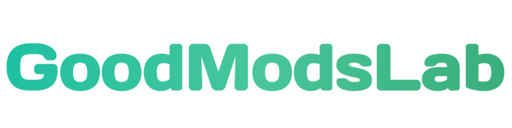

🍏Launcher for modifying games and applications

 
 

 
## Launcher for modifying games and applications
[GoodModsLab](https://GoodModsLab-official.github.io) — Launcher for modifying games and applications. Based on Java which works in Android. Install the mod on the game with just one click!
 GoodModsLab it is also a unified platform for modifying games and applications with its own mod catalog.
The platform does not bite, and you can enjoy new additions to the game.

## Alas, but GoodModsLab not a source code project
__Yes it is So.__ The launcher is licensed under its own license. You can read it under the terms of use. Even in spite of the restrictions in the distribution of the source code of the application, you can freely use the functions.
Also, the prohibition of the license includes cloning, modifying the application itself and the launcher GoodModsLab. You can also read the privacy policy on our website. 

## Ecosystem and codebase
GoodModsLab has its own ecosystem in which everyone can join. We are glad to every new participant of the project. 
Become a part of our ecosystem, - Try yourself as __ModsCreator__, create your own modifications thanks to our own programming language for modding - __Acacia__.

On our github account, you can also ask a question, as well as share ideas. We will definitely review your idea.

## Receiving GoodModsLab / Documentation

To start using the launcher functions, you just need to [install the application](https://goodmodslab-official.github.io). 
However, if you have any questions about using the launcher, check out our wiki.

💚Interpreted programming language

 
 

## New interpreted programming language
[Acacia](https://goodmodslab-official.github.io) — It is our own programming language for creating modifications to games and applications. Designed specifically for mod developers, source code that runs in the launcher GoodModsLab.
This programming language is perfect for making modifications.
Acacia does not force a particular design or coding style on you. Rather, it gives you the freedom to create the game however you like.

## Source code and ecosystem of the language
Acacia is also licensed under its own license. Unlike the launcher license, there are no major restrictions on acacia. Create modifications and projects, both commercial and non-commercial.
Acacia unites developers of mods for games. You can install third party libraries as well as create your own.

The Acacia programming language is closely related to the launcher GoodModsLab. 
